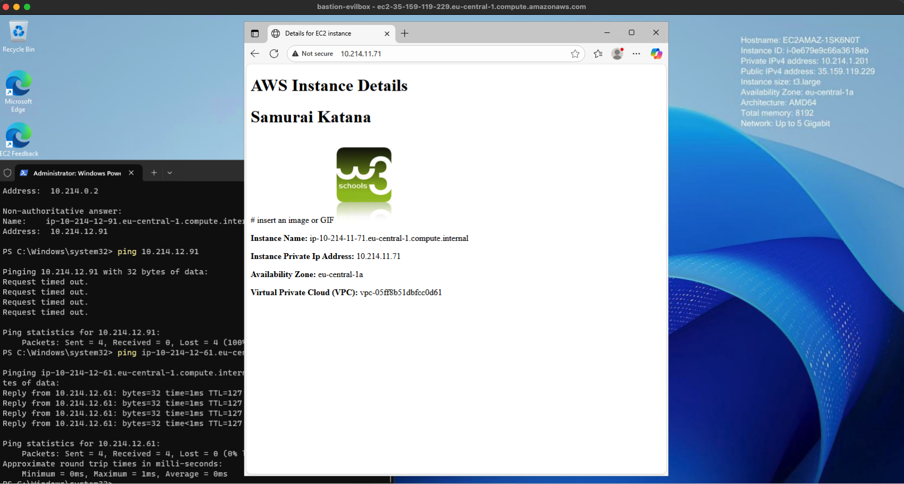
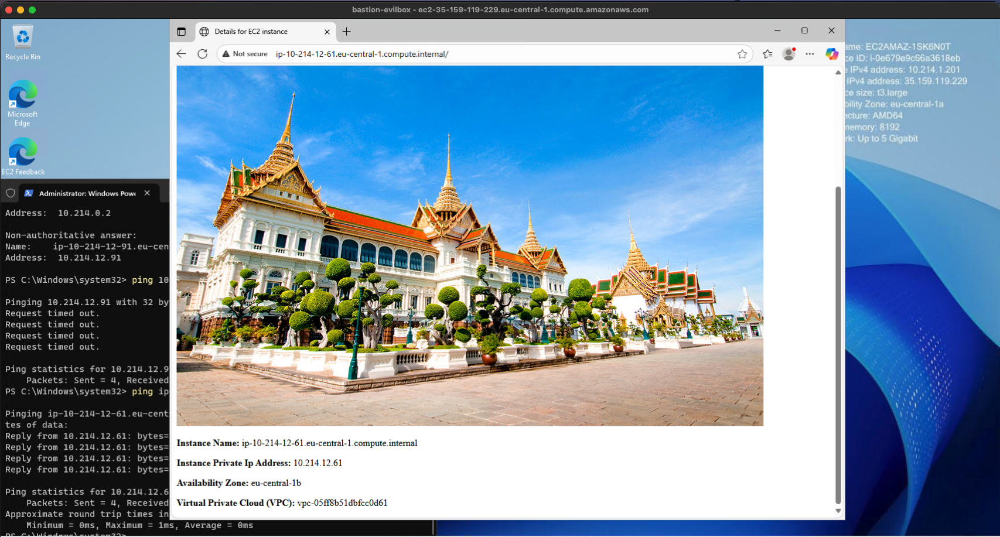
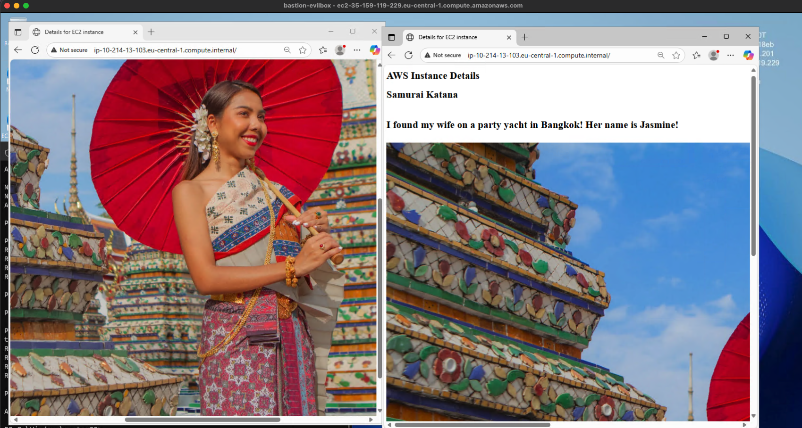

# Homework 04 Be A Man Challenge

This challenge has 1 Virtual Private Cloud with 3 public and 3 private subnets. There are 3 availability zones (AZ) utilized. Each AZ has 1 public and 1 private subnet.  

It has a single Windows bastion host deployed in a public subnet.

There is one Linux web server deployed in each availability zone in a different private subnet.

In this challenge the Windows bastion host can reach each Linux server via secure shell and via its web server. For clarity a different web page was built in each linux server identifying the specific subnet and AZ that the Linux server is in.

Deployment was performed using Hashicorp Terraform.

***
## Screenshots

### Linux Web Servers

These screenshots show the Windows bastion host connecting to each Linux web server. Highlighted sections of the screenshots show the three different AZ's.

***
## Bastion Host SSH Console Access

These screenshots show the Windows bastion host connecting to each Linux web server via *Secure Shell*.

