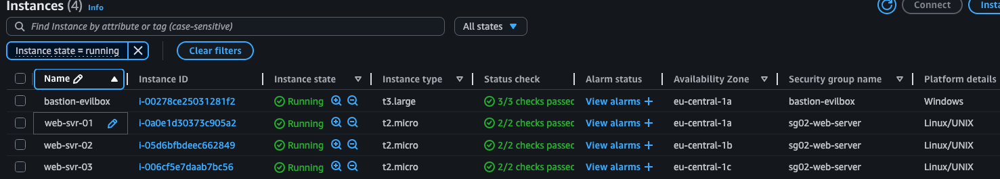
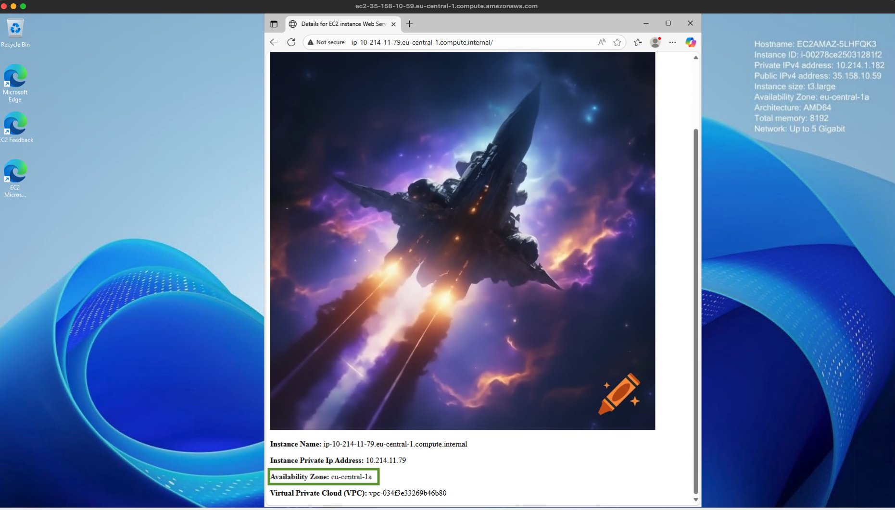
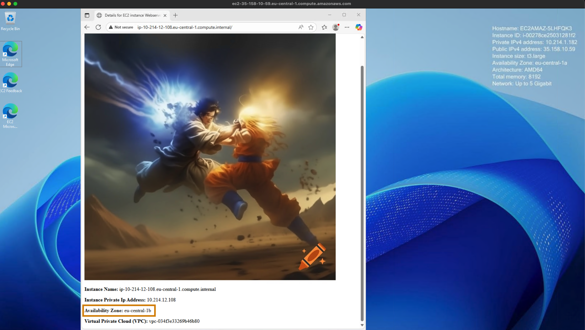
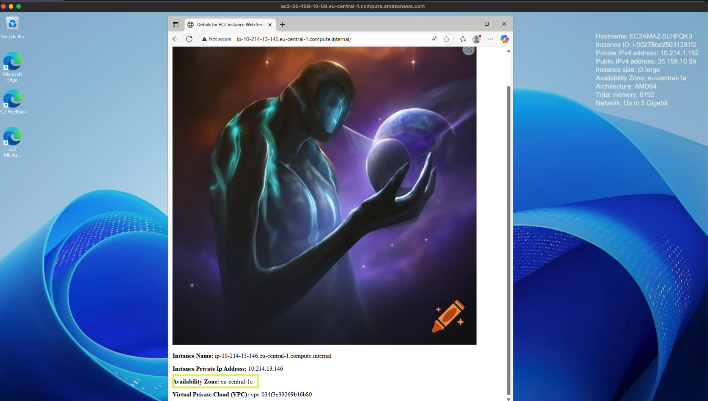
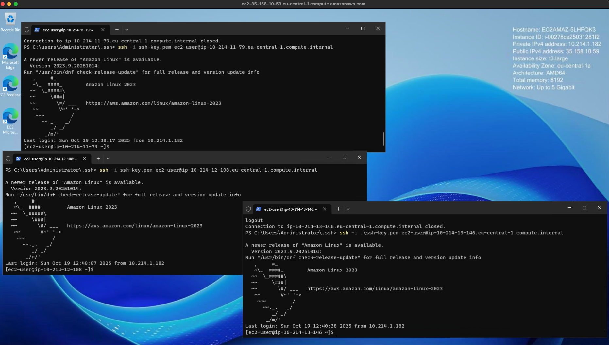

# Homework 04 Be A Man Challenge

This *Academic* challenge has 1 Virtual Private Cloud with 3 public and 3 private subnets. There are 3 availability zones (AZ) utilized. Each AZ has 1 public and 1 private subnet.  

It has a single Windows bastion host deployed in a public subnet. The security group for the bastion host automatically adds the IP address of the management workstation that is deploying the terraform code. In other words it will identify the IP address of the system being used to deploy the terraform code and add it to the bastion ingress security rule to help improve security.

You can modify it by modifying the file named 6-SG01-bastion.tf and uncommenting  #cidr_blocks = ["${var.client_ip}"] and comment the cidr_blocks = ["${local.workstation-external-cidr}"].

There is one Linux web server deployed in each availability zone in a different private subnet.

In this challenge the Windows bastion host can reach each Linux server via secure shell and via its web server. For clarity a different web page was built in each linux server identifying the specific subnet and AZ that the Linux server is in.

Deployment was performed using Hashicorp Terraform.

The terraform code outputs key information you will need such as DNS addresses of the EC2 instances and the IP address of the management workstation.

***
## Screenshots

This screenshot shows list of running instances, availability zones, security groups, and platform details.

***
### Linux Web Servers

These screenshots show the Windows bastion host connecting to each Linux web server. Highlighted sections of the screenshots show the three different AZ's.

***
## Bastion Host SSH Console Access

This screenshot shows the Windows bastion host connecting to each Linux web server via *Secure Shell*. 

The method used was to provide access to the AWS pem file. The logic behind this is that the Windows EC2 uses a different SSH key than the Linux EC2 instances. You can of course modify the keys and even add more flexibility using AWS KMS. 

The Windows bastion host can SSH to each private subnet based on a separate security group for the Linux EC2 instances which *ONLY* allows HTTP, SSH and ICMP between the Bastion and the Linux Servers.

