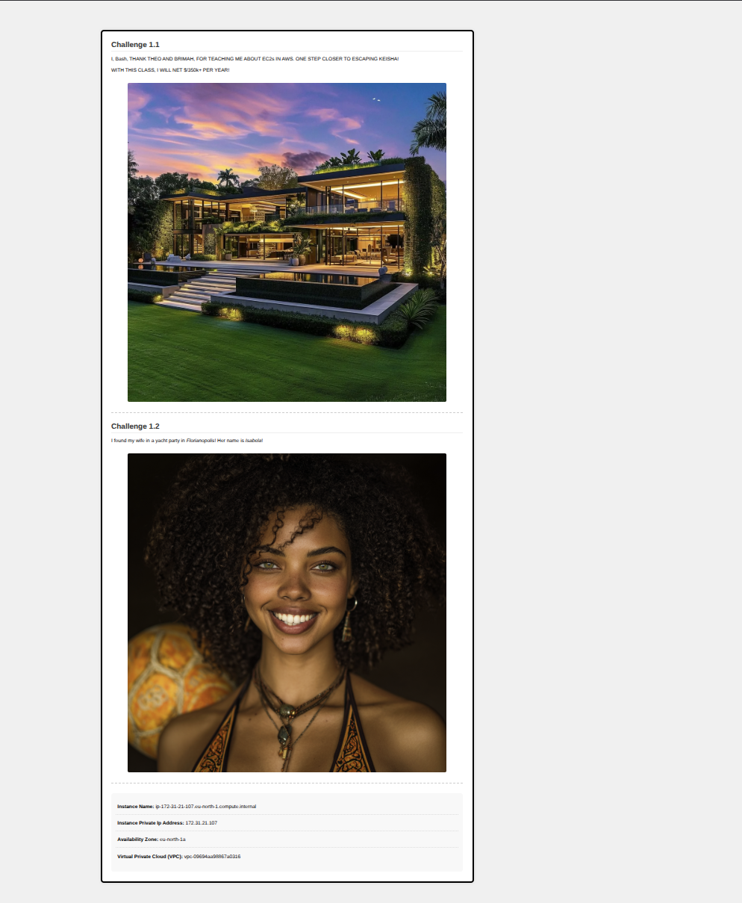
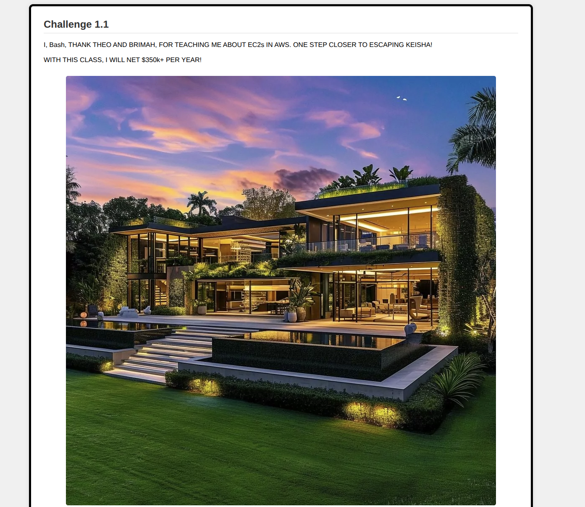
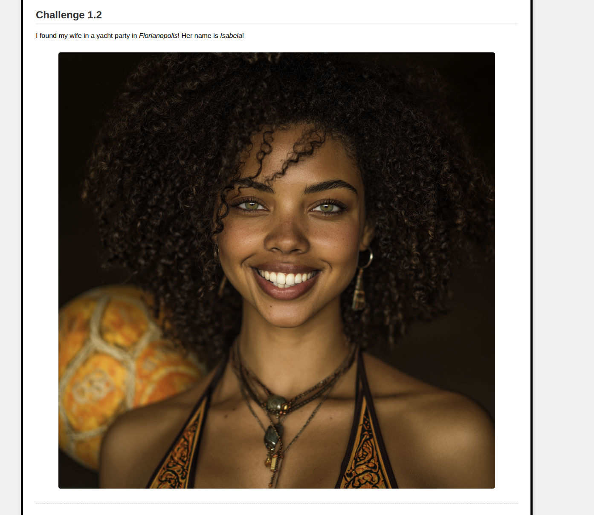
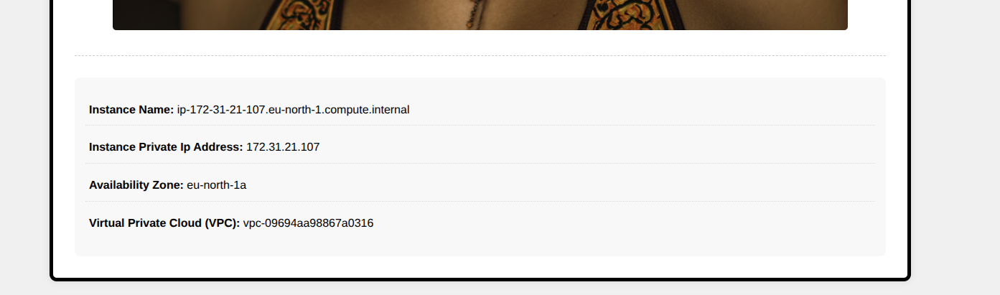
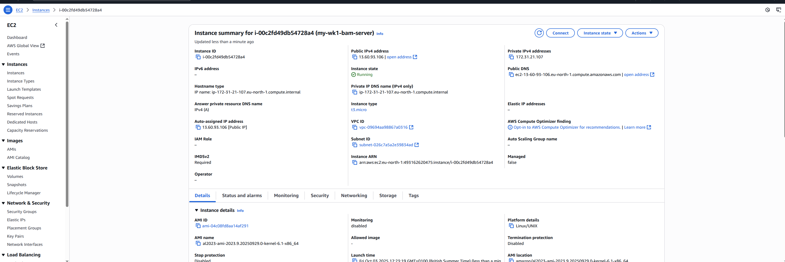

# Week 1 BAM CHALLENGES!

EC2 Basics
TheoWAF's EC2 Script --> https://github.com/BashiM1/bmc5/blob/main/ec2scrpit
My Customised EC2 Script for BAM --> https://github.com/BashiM1/bmc5/blob/main/mycustomec2script

# Images (screenshots):

BAM challenge full screenshot:
[](./images/01-bam-screenshot.png)
BAM 1.1
[](./images/02-bam-screenshot.png)
BAM 1.2
[](./images/03-bam-screenshot.png)
BAM instance Details
[](./images/04-bam-screenshot.png)
BAM instance Summary
[](./images/05-bam-screenshot.png)


# My complete customised ec2 script:

```bash
#!/bin/bash
# Use this for your user data (script from top to bottom)
# install httpd (Linux 2 version)
yum update -y
yum install -y httpd
systemctl start httpd
systemctl enable httpd

# Get the IMDSv2 token
TOKEN=$(curl -X PUT "http://169.254.169.254/latest/api/token" -H "X-aws-ec2-metadata-token-ttl-seconds: 21600")

# Background the curl requests
curl -H "X-aws-ec2-metadata-token: $TOKEN" -s http://169.254.169.254/latest/meta-data/local-ipv4 &> /tmp/local_ipv4 &
curl -H "X-aws-ec2-metadata-token: $TOKEN" -s http://169.254.169.254/latest/meta-data/placement/availability-zone &> /tmp/az &
curl -H "X-aws-ec2-metadata-token: $TOKEN" -s http://169.254.169.254/latest/meta-data/network/interfaces/macs/ &> /tmp/macid &
wait

macid=$(cat /tmp/macid)
local_ipv4=$(cat /tmp/local_ipv4)
az=$(cat /tmp/az)
vpc=$(curl -H "X-aws-ec2-metadata-token: $TOKEN" -s http://169.254.169.254/latest/meta-data/network/interfaces/macs/${macid}/vpc-id)

echo "
<!DOCTYPE html>
<html lang="en">
<head>
    <meta charset="UTF-8">
    <meta name="viewport" content="width=device-width, initial-scale=1.0">
    <title>Basic EC2 HW Assignment</title>
    <style>
        * {
            box-sizing: border-box;
            margin: 0;
            padding: 0;
        }
        
        body {
            font-family: sans-serif;
            background-color: #f0f0f0;
            padding: 20px;
            min-height: 100vh;
            display: flex;
            justify-content: center;
            align-items: center;
        }

        .container {
            background-color: white;
            padding: 20px;
            border: 5px solid black;
            border-radius: 10px;
            box-shadow: 0 0 10px rgba(0,0,0,0.1);
            width: 100%;
            max-width: 1200px;
        }

        .challenge-section {
            margin-bottom: 30px;
            padding-bottom: 20px;
            border-bottom: 1px dashed #ccc;
        }

        .challenge-section:last-of-type {
            border-bottom: none;
            margin-bottom: 20px;
        }

        img {
            display: block;
            max-width: 100%;
            height: auto;
            margin: 15px auto;
            border-radius: 5px;
        }

        .info-section {
            background-color: #f8f8f8;
            padding: 15px;
            border-radius: 8px;
            margin-top: 20px;
        }

        .info-section p {
            margin: 10px 0;
            padding: 8px 5px;
            border-bottom: 1px dotted #ddd;
        }

        .info-section p:last-child {
            border-bottom: none;
        }

        h2 {
            color: #333;
            margin-bottom: 15px;
            padding-bottom: 5px;
            border-bottom: 2px solid #eee;
        }

        p {
            line-height: 1.6;
            margin-bottom: 10px;
        }

        i {
            color: #4a4a4a;
        }

        /* Mobile-first responsive design */
        @media (max-width: 767px) {
            body {
                padding: 10px;
            }
            
            .container {
                padding: 15px;
            }
            
            h2 {
                font-size: 1.3rem;
            }
            
            .info-section {
                padding: 10px;
            }
        }

        /* Tablet styles */
        @media (min-width: 768px) and (max-width: 991px) {
            .container {
                max-width: 90%;
            }
        }

        /* Desktop enhancements */
        @media (min-width: 992px) {
            .container {
                padding: 30px;
            }
            
            .challenge-section {
                display: flex;
                flex-direction: column;
            }
        }
    </style>
</head>
<body>
    <div class="container">
        <div class="challenge-section">
            <h2>Challenge 1.1</h2>
            <p>I, Bash, THANK THEO AND BRIMAH, FOR TEACHING ME ABOUT EC2s IN AWS. ONE STEP CLOSER TO ESCAPING KEISHA!</p>
            <p>WITH THIS CLASS, I WILL NET $/350k+ PER YEAR!</p>
            
        </div>
        
        <div class="challenge-section">
            <h2>Challenge 1.2</h2>
            <p>I found my wife in a yacht party in <em>Florianopolis</em>! Her name is <em>Isabela</em>!</p>
            
        </div>

        <div class="info-section">
            <p><b>Instance Name:</b> $(hostname -f)</p>
            <p><b>Instance Private Ip Address: </b> ${local_ipv4}</p>
            <p><b>Availability Zone: </b> ${az}</p>
            <p><b>Virtual Private Cloud (VPC):</b> ${vpc}</p>
        </div>
    </div>
</body>
</html>
" > /var/www/html/index.html

# Clean up the temp files
rm -f /tmp/local_ipv4 /tmp/az /tmp/macid

```
---